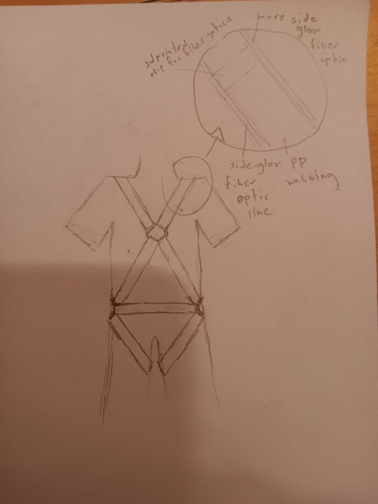
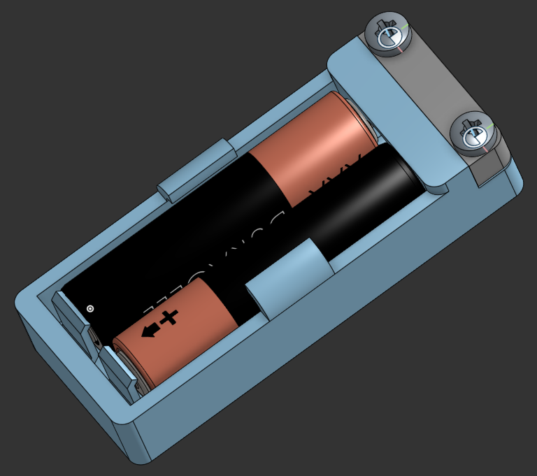
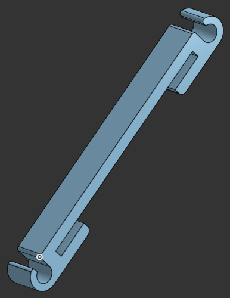

## Polypropylene X-harness with leg straps, trimmed with side-glow optical fiber.

I'm making this since I need a wearable source of UV light to go with some really cool UV reactive clothing I have. I settled on a harness since it both looks sick, and fills blank space on an outfit nicely.

## Concept Sketch: 

## CAD ([OnShape link here](https://cad.onshape.com/documents/844092a518c04a0d7647dbf2/w/aecd2935d022b177f3481e16/e/bcc2b279fdcb40cd7b3ab8ba?renderMode=0&uiState=6a279fb0b3b20002e5f526e5))
### Battery an LED holder:

### Clips for optical fiber:

## I wanna make this myself!
### Parts:

> **Prices are approximate, and may vary. My total cost was about $100.**

| Item                                | Price Each | Qty |
|-------------------------------------|------------|-----|
| PP Webbing                          | 8          | 1   |
| 2-5/8in Metal Rings                 | 4          | 4   |
| Buckles                             | 1          | 7   |
| Sliders                             | 1          | 7   |
| 16 ft .12in Side-glow Optical Fiber | 20         | 2   |
| UV-A LED                            | 1          | 2   |
| AAA Battery                         | 1          | 4   |

### Instructions: 
- Build the harness by cutting the PP webbing, assembling as necessary, and and sewing the PP webbing using a boxed-x stitch where needed.
- Print ~10-20 clips for the optical fiber, and 2 battery cases, or 4 if you want to illuminate both ends.
- Plan out a route for your fiber optics, and put clips on the webbing along that route.
- Route the optical fiber, and secure the battery holders.
